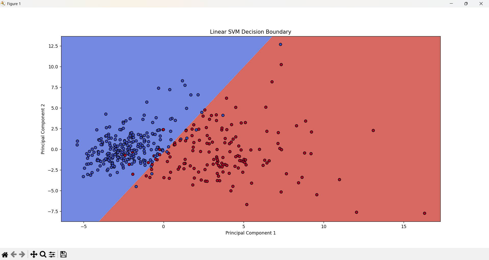
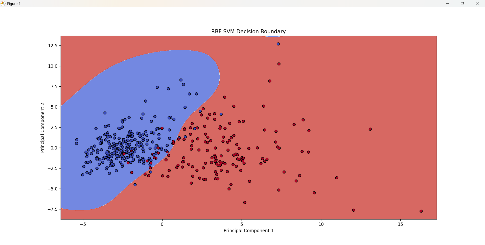

#  Breast Cancer Prediction using SVM

This project applies **Support Vector Machines (SVM)** to classify breast cancer tumors as malignant or benign using the **Breast Cancer Wisconsin dataset**. It includes preprocessing, dimensionality reduction with PCA, model training using different SVM kernels, visualization of decision boundaries, hyperparameter tuning, and evaluation.

---

##  Dataset

- **Source**: `breast-cancer.csv` (modified Breast Cancer Wisconsin dataset).
- **Target Feature**: `diagnosis`  
  - `M` → Malignant (mapped to `1`)  
  - `B` → Benign (mapped to `0`)
- **Features**: 30 numeric features derived from cell nuclei in digitized images of fine needle aspirates (FNA) of breast mass.

---

##  Preprocessing Steps

1. **Label Encoding**:
   - Converted target labels: `M` → 1, `B` → 0.
2. **Feature Scaling**:
   - Standardized features using `StandardScaler`.
3. **Train-Test Split**:
   - 70% training, 30% testing (`random_state=42`).
4. **Dimensionality Reduction**:
   - Applied **PCA** to reduce features from 30D → 2D for visualizing decision boundaries.

---

##  SVM Modeling and Evaluation

### 🔹 1. Linear SVM (with PCA-Reduced Data)

- **Kernel**: Linear
- **C**: 1.0  
- **Visualization**: Decision boundary plotted using first two principal components.

####  Results
- **Test Accuracy**: ~`X.XX`
- **Confusion Matrix**:  
  Displayed using `confusion_matrix()`
- **Classification Report**:  
  Includes precision, recall, and F1-score.

---

###  2. RBF Kernel SVM (with PCA-Reduced Data)

- **Kernel**: RBF
- **Gamma**: scale
- **C**: 1.0  
- **Visualization**: Plotted similarly on PCA-reduced components.

####  Results
- **Test Accuracy**: ~`X.XX`
- **Confusion Matrix**
- **Classification Report**

---

###  3. Hyperparameter Tuning with GridSearchCV

Performed grid search over:
```python
param_grid = {
    'C': [0.1, 1, 10, 100],
    'gamma': ['scale', 'auto', 0.1, 1, 10],
    'kernel': ['rbf', 'linear']
}
```

##Decision Boundary Plots

### Linear SVM


###RBF SVM

